# 轮腿平衡车
北极熊的mini轮腿平衡车车项目，打造一款萌宠小平衡。

如对本项目有疑问，请先阅读doc文件夹中的文档。

> 
-----=====完结咯=====----- 
> 🎉🎉🎉🎉🎉🎉🎉🎉

> 基础功能已经实现，但还有许多问题仍待解决，也还有一些改进方向还未完成。 
> 不过作为平衡步兵的领路项目应该足以让我们的电控人了解平衡的基本实现方法与开发过程了。 
> 接下来该接过我的接力棒继续在这个小平衡车车打下的坚实基础上蓬勃发展了。  
> 本项目自2023.9.19开始，经历了2个多月的开发。 
> 从一开始盲目的想着一星期速通平衡热血澎湃 
> 到国庆期间各种错误和碰壁的情绪低谷 
> 再到实车成功站立的欣喜与激动 
> 这一路上经历了许多起起落落，但我们不曾放弃，最终走出迷雾迎来黎明。  
> 
小企鹅 于 2023.11.25

## 电机标号

 

本项目中前方方向为电池开关方向。

关节电机选用小米电机，接入CAN1，各电机id如图所示。

驱动轮电机选用2006，接入CAN2，各电机id如图所示。

## 操作说明
鉴于小米电机的控制反馈问题，目前打算先用几何解算来使用位置模式达到控制效果。
1. 准备模式，遥控器左端拨杆置于`OFF`档，初始化收腿（此时将右拨杆置于`ATII`裆重新标定电机零点）
2. 腿部伸长，遥控器左端拨杆置于`CL`档，此时腿部伸长到指定位置
3. 将机器人竖直放置
4. 开始平衡，遥控器左端拨杆置于`HL`档，此时差不多能平衡了。

如何控制这只小平衡：
- 右摇杆控制速度和旋转。
- 左摇杆控制腿长和roll角。

## 参考
- [RoboMaster平衡步兵机器人控制系统设计](https://zhuanlan.zhihu.com/p/563048952)
- [无刷轮腿平衡机器人开源GitHub仓库](https://github.com/Skythinker616/foc-wheel-legged-robot/tree/master)
- [2023 EC basic-framework](https://gitee.com/hnuyuelurm/balance_chassis)

详见 [reference](./doc/reference.md)

## 相关文档
- [五连杆几何学解算](./doc/五连杆几何学解算.md)
- [问题列表](./doc/问题列表.md)
- [开发方向](./doc/开发方向.md)