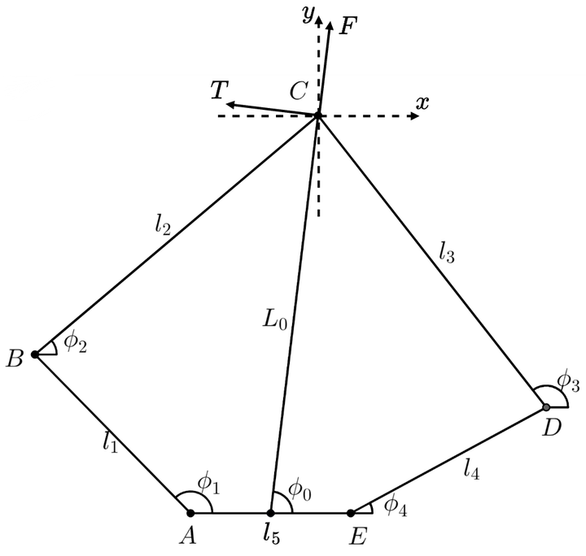

# 五连杆几何学解算

## 五连杆几何学正向解算(LegPos)

五连杆机构参数定义如图所示，其中 $A,E$ 两转动副由电机驱动，其角度 $\phi_1,\phi_4$ 可通过电机编码器测得。控制任务中主要关注五连杆机构末端 $C$ 点的位置，通常可用直角坐标 $(x,y)$ 或极坐标 $(L_0,\phi_0)$ 表示。

通过五连杆左右两部分列写 $C$ 点坐标，可得到以下等式：
$$
\left \{
    \begin{array}{}
        x_B + l_2 \cos\phi_2 = x_D + l_3 \cos\phi_3 \\
        y_B + l_2 \sin\phi_2 = y_D + l_3 \sin\phi_3 \\
    \end{array}
\right .
$$
求解方程组可得到角度 $\phi_2$ ：
$$
\phi_2 = 
2 \arctan
    \left(
        \frac{B_0+\sqrt{A_0^2+B_0^2-C_0^2}}{A_0+C_0}
    \right)
$$
其中：
$$
\begin{array}{}
    A_0 = 2l_2(x_D-x_B) \\
    B_0 = 2l_2(y_D-y_B) \\
    C_0 = l_2^2+l_{BD}^2-l_3^2\\
    l_{BD} = \sqrt{(x_D-x_B)^2+(y_D-y_B)^2}
\end{array}
$$
通过角度 $\phi_2$ 即可解算出 $C$ 点直角坐标 $(x,y)$：
$$
\begin{array}{}
    x_C = l_1\cos\phi_1 + l_2\cos\phi_2\\
    y_C = l_1\sin\phi_1 + l_2\sin\phi_2\\
\end{array}
$$
进而得到极坐标 $(L_0,\phi_0)$：
$$
\left \{
    \begin{array}{}
        L_0 = \sqrt{(x_C-\frac{l_5}{2})^2+y_C^2} \\
        \phi_0 = \arctan\frac{y_C}{x_C-\frac{l_5}{2}}
    \end{array}
\right .
$$

## 五连杆几何学逆向解算(JointPos)
### 