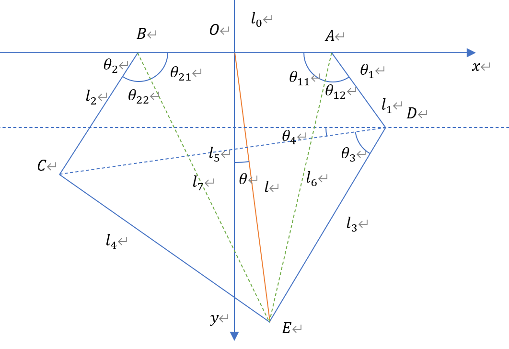

# 五连杆几何学解算

## 五连杆几何学正向解算

已知：$O点为AB中点\\
AB长l_0,AD长l_1,BC长l_2,DE长l_3,CE长l_4\\
\angle OAD为\theta_1,\angle OBC为\theta_2
$

求：$E的坐标或(OE长l和OE偏转角\theta)$

$易得C(-\frac{l_0}{2}+l_2\cdot\cos\theta_2,l_2\cdot\sin\theta_2)\ ,\ D(\frac{l_0}{2}-l_1\cdot\cos\theta_1,l_1\cdot\sin\theta_1)$

$CD^2为l_5^2=(l_1
-l_1\cdot\cos\theta_1-l_2\cdot\cos\theta_2)^2+
(l_1\cdot\sin\theta_1-l_2\cdot\sin\theta_2)^2$

$\theta_3 = \arccos \frac{l_4^2-l_5^2-l_3^2}{2\cdot l_3\cdot l_5}\\$
<!-- =\arccos\frac{
    l_4^2-l_3^2-(l_1
    -l_1\cdot\cos\theta_1-l_2\cdot\cos\theta_2)^2-
    (l_1\cdot\sin\theta_1-l_2\cdot\sin\theta_2)^2
}{2\cdot l_3\cdot\sqrt{(l_1
-l_1\cdot\cos\theta_1-l_2\cdot\cos\theta_2)^2+
(l_1\cdot\sin\theta_1-l_2\cdot\sin\theta_2)^2}}$ -->

$\theta_4 = \arctan\frac{l_2\cdot\sin\theta_2 - l_1\cdot\sin\theta_1}{l_1-l_1\cdot\cos\theta_1-l_2\cdot\cos\theta_2}$

$得E(\frac{l_0}{2}-l_1\cdot\cos\theta_1+l_3\cdot\cos{(\theta_3+\theta_4)},l_1\cdot\sin\theta_1+l_3\cdot\sin{(\theta_3+\theta_4)})$

$得OE^2为\\
l^2 = (\frac{l_0}{2}-l_1\cdot\cos\theta_1-l_3\cdot\cos{(\theta_3+\theta_4)})^2 + (l_1\cdot\sin\theta_1+l_3\cdot\sin{(\theta_3+\theta_4)})^2$

$\theta = \arctan\frac{\frac{l_0}{2}-l_1\cdot\cos\theta_1-l_3\cdot\cos{(\theta_3+\theta_4)}}{l_1\cdot\sin\theta_1+l_3\cdot\sin{(\theta_3+\theta_4)}}$

## 五连杆几何学逆向解算

已知：$O点为AB中点\\
AB长l_0,AD长l_1,BC长l_2,DE长l_3,CE长l_4\\
OE长l和OE偏转角\theta
$

求：$AD偏转角\theta_1和BC偏转角\theta_2$

$E(l\cdot\cos\theta,l\cdot\sin\theta)$

$AE^2为\\
l_6^2 = l^2+(\frac{l_0}{2})^2-2\cdot l \cdot \frac{l_0}{2}\cdot\cos(\frac{\pi}{2}-\theta)\\
=l^2+(\frac{l_0}{2})^2-l \cdot l_0\cdot\sin\theta$

$\theta_{11} = \arccos \frac{l^2-(\frac{l_0}{2})^2-l_6^2}{l_0\cdot l_6}\\
\theta_{12} = \arccos \frac{l_3^2-l_1^2-l_6^2}{2\cdot l_1\cdot l_6}\\$

$BE^2为\\
l_7^2 = l^2+(\frac{l_0}{2})^2-2\cdot l \cdot \frac{l_0}{2}\cdot\cos(\frac{\pi}{2}+\theta)\\
=l^2+(\frac{l_0}{2})^2+l \cdot l_0\cdot\sin\theta$

$\theta_{21} = \arccos \frac{l^2-(\frac{l_0}{2})^2-l_7^2}{l_0\cdot l_7}\\
\theta_{12} = \arccos \frac{l_4^2-l_2^2-l_7^2}{2\cdot l_2\cdot l_7}\\$

综上可得：$\theta_1 = \theta_{11}+\theta_{12},\theta_2 = \theta_{21}+\theta_{22}$